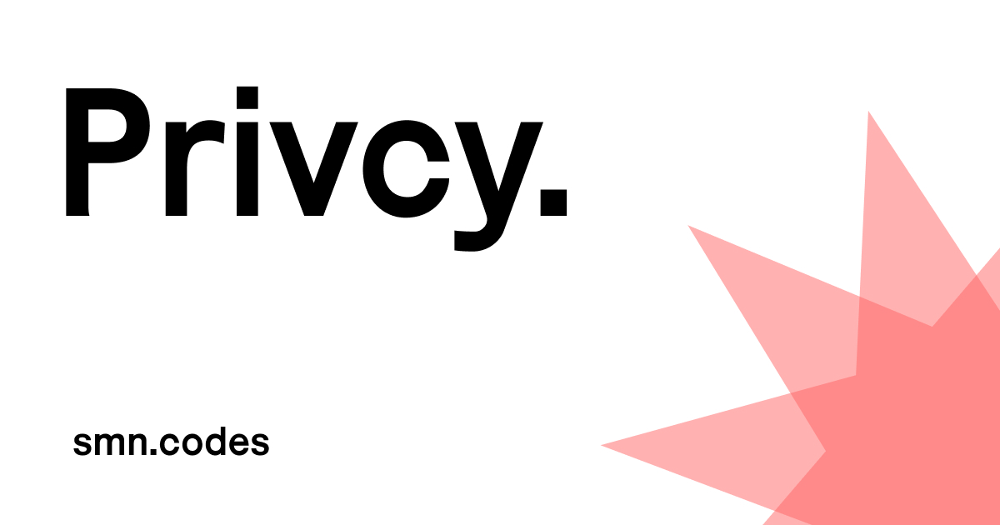

## [](https://privcy.smn.codes)

This is my take on a reactive privacy/cookie consent banner.


⚠️ Here be dragons ⚠️
----------------------

At the time of writing this repo is quite experimental. It works, but could use some work, and more extensive documentation. Use at your own risk.


Installation
------------

To get started, run:

```bash
pnpm add privcy
```

You can then either add the script straight into your HTML in a script tag:

```html
<script src="https://unpkg.com/privcy@latest/dist/privcy.iife.js"></script>
<script>
  new window.Privcy({
    title: 'Privacy',
    description: '<p>We have some really nice cookies!</p>',
    categories: {
      analytics: {
        name: 'Analytics',
        description: 'These are analytics cookies',
      },
      social: {
        name: 'Social',
        description: 'These are social cookies',
      },
    },
  });
</script>
```

You can also import it as a module:

```typescript
// index.ts
import Privcy from 'privcy';

new Privcy({
  title: 'Privacy',
  description: '<p>We have some really nice cookies!</p>',
  categories: {
    categories: {
      analytics: {
        name: 'Analytics',
        description: 'These are analytics cookies',
      },
      social: {
        name: 'Social',
        description: 'These are social cookies',
      },
    },
  },
});
```

Then, the scripts you want to control need to be modified with the `data-privcy` tag:

```html
<script
  data-privcy='{
    "category": "analytics",
    "src": "/path/to/script.js"
  }'
></script>
```

This also works with iframes:

```html
<iframe
  data-privcy='{
    "category": "social",
    "src": "https://example.com"
  }'
></iframe>
```

To control a inline script, you can omit the `src` key in `data-privcy`, but you need to make sure that the script type is set to `plain/text`:

```html
<script
  data-privcy='{
    "category": "social"
  }'
  type="plain/text"
>
  console.log('Hello World!')
</script>
```

File sizes
----------
|Format                     |Size    |gZip   
|---                        |---     |---    
|dist/privcy.js (ESM)       |28.45 kB|8.53 kB
|dist/privcy.iife.js (IIFE) |17.57 kB|6.74 kB

Ownership
---------

Copyright (©) 2024 Simon Lagerlöf

Licensed under the [BSD 3 Clause license](./LICENSE).